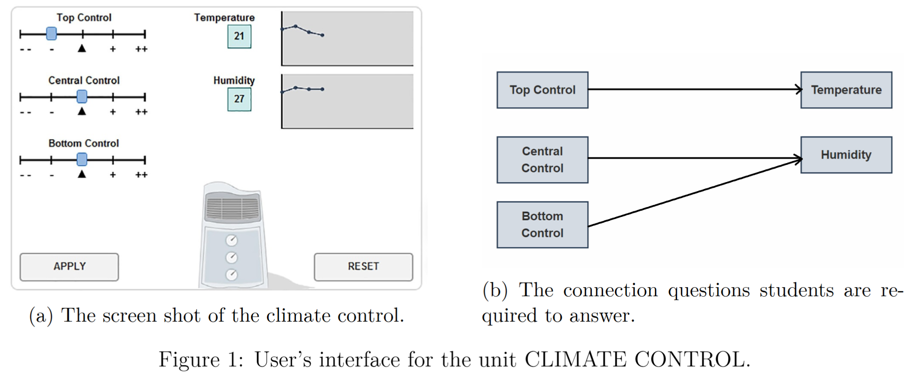
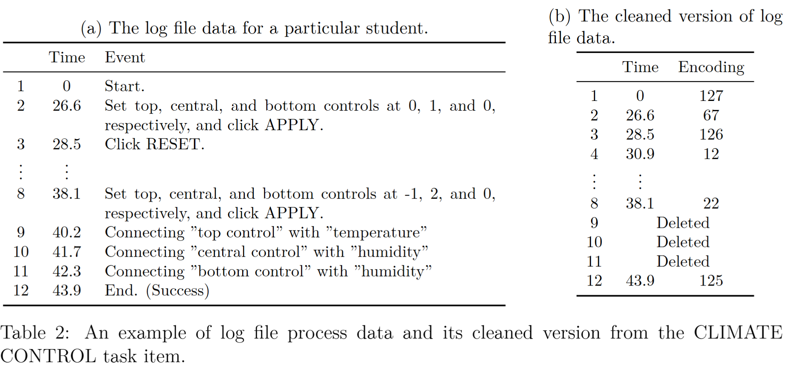
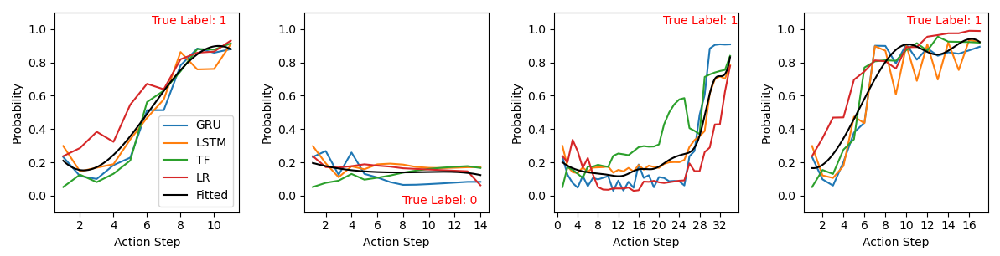
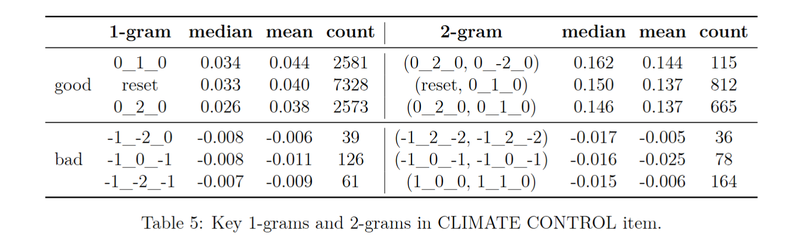

## Model-Agnostic Prediction Framework for CPS Process Data Analysis

This repository contains the implementation of the models and the analysis framework presented in our paper **"An Implementation-Friendly Model-Agnostic Approach for Process Data Analysis."**  
<!-- It provides tools for analyzing CPS process data, fitting probability curves, and solving downstream tasks.   -->

---

### Features  
- Implements Logistic Regression, GRU, LSTM, and Transformer models for log file process data analysis.  
- Construct dynamic probability curves to characterize the complete response process of students and demonstrate that this characterization is model-free.
- Applicable to a wide range of downstream tasks, such as individual classification and identification of key actions.
- Test on several questions of PISA 2012 problem-solving assesment and proves that the proposed framework is item-free, meaning it does not rely on question type or task-specific prior expert knowledge.

---

### Directory Structure  
```
.
├── example_data/       # Example processed input data
├── models/             # Model definitions (GRU, LSTM, Transformer and Logistic Regression)
├── utils/              # Utility functions
├── scripts/            # Scripts for data loading, training, probability curve construction, model-agnostic evaluation, and solving downstream tasks
├── results/            # Sample train/test data splits and analysis results for three representative questions from PISA 2012
├── config.yaml         # Configuration file for model parameters, training, testing, and output settings
├── run_all.py          # Main script to execute all processes
└── requirements.txt    # Python dependencies
```

For convenience and reproducibility, we release the processed train/test splits under the `results/` folder, which can be used directly with our code.

**Raw data** is available from the [OECD PISA 2012 log file database](https://www.oecd.org/content/dam/oecd/en/data/datasets/pisa/pisa-2012-datasets/cba-pisa-2012/log-file-databases/CPRO_logdata_released.zip).
In this dataset, `cp025q01`, `cp007q03`, and `cp038q01` correspond to the three items “Climate Control”, “Traffic”, and “Tickets”, respectively.


---

### Sample Question: Climate Control

  

Data regarding students’ problem-solving processes were collected through computer log files, in the form of a sequence of time-stamped events.

  

### Implementations 

Install dependencies:  
   ```bash
   pip install -r requirements.txt
   ```  

Then, we provide several key experimental results along with the corresponding code to reproduce them.

**1. Generating Probability Curves**

Run the following command to (i) train the models on the sample dataset and (ii) compute the step-wise probability curves from the trained models.
   ```bash
   python scripts/train.py
   python scripts/curves_construction.py
   ```  
 

**2. Downstream Tasks**
   ```bash
   python scripts/downstream_tasks.py
   ```  
Using the command above, you can solve several downstream tasks including identifying key actions and clustering students based on their predicted probability curves.

 

 

**3. Model-Agnostic Evaluation**

We evaluate predictive performance using Accuracy and AUC, and quantify the similarity between probability curves using curve-level similarity metrics.
   ```bash
   python scripts/evaluation.py
   ```  
 


**Run all**  

The above commands support multiple tasks. To run the full pipeline end-to-end, use:
```bash
python run_all.py
```  
  
---


### Citation  
If you use this code or framework in your research, please cite our paper. 

---

### License  
This project is licensed under the Apache License. See the [LICENSE](LICENSE) file for details.  

